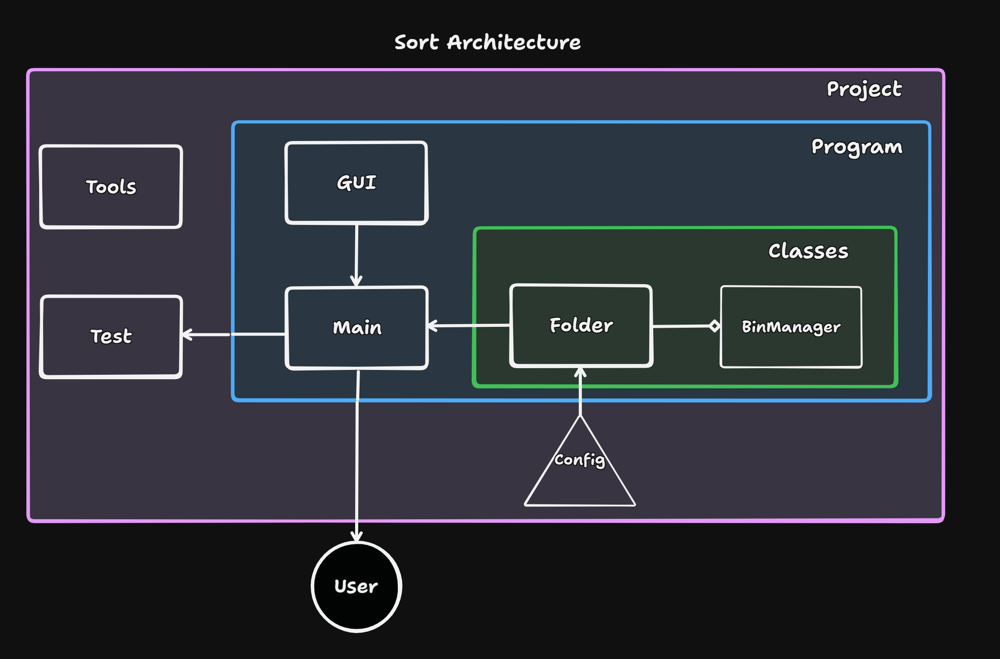

# Sort
##### *Kareem T | 7/28/2025*

A command-line tool that organizes a folder by sorting its contents into sub-folders based on file-types.

Files are sorted into folders based on their associated container listed in the config; folders are sent to the "folders" directory.

### Features
- Command-Line Interface (CLI)
- Sort any directory into folders based on file-type
- Change target directory
- Configure new or existing folders, filetypes
- Print directory contents

The current folders are (example file-types listed):
- Archives (.zip)
- Executables (.exe)
- Folders (dir)
- Documents (.pdf)
- Scripts (.py)
- Unknown
- Images (.png)
- Music (.mp3)
- Videos (.mp4)
- Disk-Images (.iso)

The sort can be reversed or performed on any directory path.

**Caution: The sorting operation in this program uses the 'shutil' command to move files, which can be unreliable if you are moving a folder and your disk is nearly full. The command copies the folder, then deletes the original when complete; this initial copy can fill up the drive, failing the sort. If this happens, either move all files from the original to the new folder, or vice versa. The 'DirCmp.py' script in the Tools folder will show you which files exist in each directory.**
  
### Instructions
1. Start the program by running 'main.py' from a command-line terminal
2. Specify the target directory for sorting. By default, the program selects the user's downloads folder, but this can be changed by typing 3 and specifying the path
3. (Optional) Print the contents to verify the directory's contents are correct
4. Sort the directory using the first command line option
- Double check afterwards to ensure the sorting operation completed successfully

### About

This is a simple script I created to help people organize their space. 

Add whichever folders and extensions you'd like for your sorting by editing the config.json file (be sure to maintain the content structure).

### Architecture

### Version History
* 1.0 - automatically sorts downloads folder into containers as a .py script
* 1.1 - adds the ability to both change and print target directories. Also adds user-input functionality
* 1.2 - adds editing extensions and buckets. WIP: Moving edit/config functionality to .ini with file I/O
* 1.3 - fixes a bug where the program would crash when a file already existed
* 1.4 - adds reversing to a sort, optimizes code by factoring down and enhancing readability
* 1.5 - removes config library, reduces code size via new Path/Container objects (Objects.py)
* 1.6 - code cleaning and refactoring into new separate modules (Folder, BinManager). Removed IO module.
* 1.7 - tools, architecture cleanup